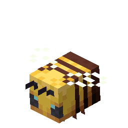

 
 

<h1>My</h1>
<label style="display:block;text-align:end;color:#60606060;text-decoration-line:underline;cursor:pointer;"><input type="checkbox" style="cursor:pointer;"/>stop anim</label>

 

  
  
  
  
  
 

 

  
  
  
  
  
  
  
 

 

  <!---->
  <!---->
  
  
  
  
  
 

<h1 style="text-align: end">Tech stack</h1>
